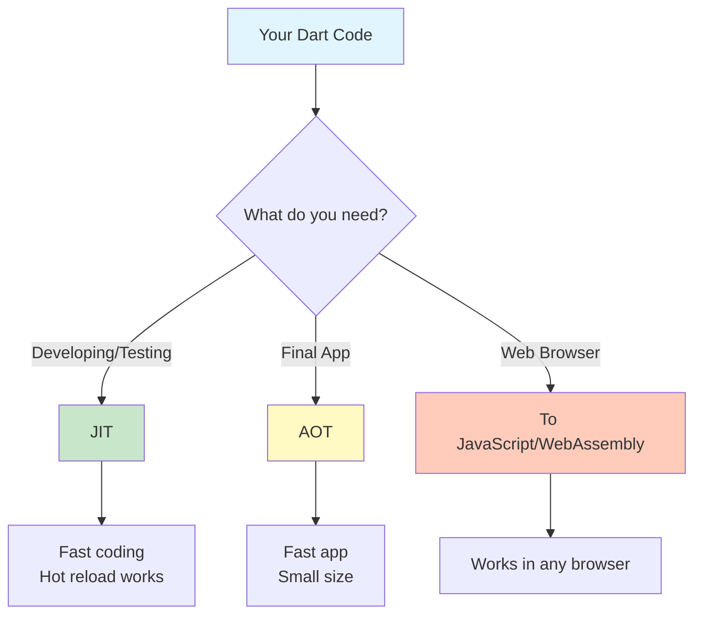
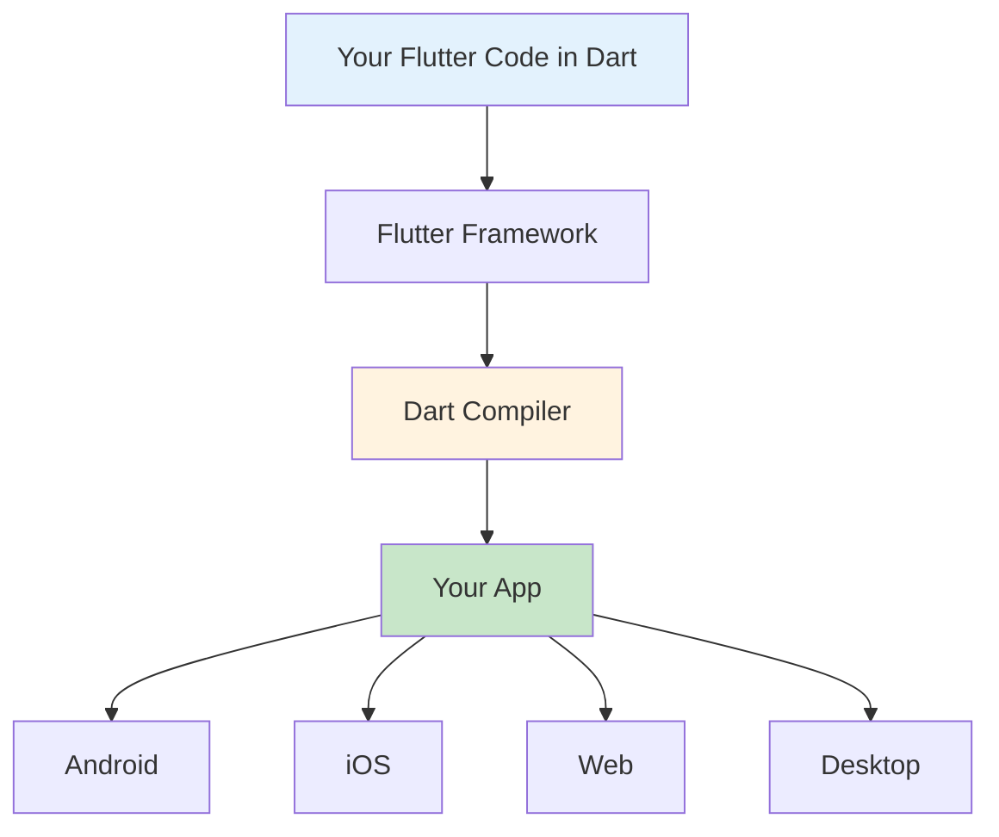
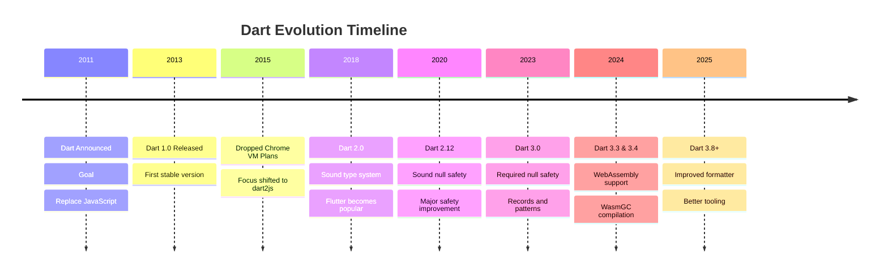

# Introduction to Dart

**A simple guide for developers learning Dart**

---

## 1. Why Google Made Dart

### The Problem in 2010

In 2010, JavaScript had big problems:

- **Slow performance** in big web apps
- **No type checking** - errors only show when code runs
- **Hard to build large projects**
- **Bad tools** for developers

Google was building huge web apps like Gmail and Google Maps. JavaScript was not strong enough.

### Dart Was Born

In 2011, Google created **Dart**. The team included:

- **Lars Bak** – made the V8 JavaScript engine
- **Kasper Lund** – also made V8
- **Gilad Bracha** – worked on Java

**The goal**: Make a better language than JavaScript for building web apps.

Google wanted Dart to replace JavaScript. But that didn't happen.

---

## 2. What Is Dart?

### A Simple Definition

**Dart** is a programming language made by Google. You can use it to build:

- Mobile apps (with Flutter)
- Web apps
- Desktop apps
- Server programs

### Main Features

- **Object-oriented**: Everything is an object
- **Typed**: Variables have types (like String, int)
- **Null-safe**: Stops null errors before code runs
- **Fast**: Compiles to fast machine code

### Compared to Other Languages

| Feature | Dart | JavaScript | Java |
|---------|------|------------|------|
| **Type checking** | Yes | No | Yes |
| **Null safety** | Yes | No | Partial |
| **Easy to learn** | Medium | Easy | Hard |
| **Where it runs** | Everywhere | Everywhere | Everywhere |

---

## 3. Basic Concepts

### Everything Is an Object

In Dart, numbers, text, functions - everything is an object. This makes the language simple and consistent.

### Null Safety

**Problem**: In many languages, variables can be `null` (empty). This causes crashes.

**Dart's solution**: 
- Normal variables cannot be null: `String name`
- If you want null, add `?`: `String? name`

The compiler checks this. No more null crashes!

### How Dart Handles Multiple Tasks

Dart uses **isolates** instead of threads.

**What is an isolate?**
- A separate worker
- Has its own memory
- Cannot share data directly
- Talks to other isolates by sending messages

**Why this is good:**
- No crashes from shared memory
- Safer and easier to understand

### Async Programming

Dart can do tasks without waiting (like downloading data).

**Tools for async:**
- **Future**: For one result later
- **Stream**: For many results over time
- **async/await**: Makes async code look normal

---

## 4. How Dart Code Becomes a Running Program

### Three Ways to Compile

Dart has three different ways to turn your code into something that runs:

### JIT - Just In Time (For Development)

**What it means**: Code compiles **while you work**.

**How it works**:
1. You write code
2. You run the app
3. Dart compiles code as needed
4. You see results fast
5. You change code
6. Only changed parts recompile (**hot reload**)

**Why use it:**
- Very fast to test changes
- See results in 1 second
- Easy to fix bugs

**The bad part:**
- App starts slower
- Uses more memory

---

### AOT - Ahead Of Time (For Final Apps)

**What it means**: Code compiles **before** anyone uses it.

**How it works**:
1. You finish writing code
2. Dart compiles everything
3. Creates machine code (0s and 1s)
4. Removes unused code
5. Makes a small, fast app

**Why use it:**
- App starts instantly
- Runs very fast
- Small file size
- No compiler needed in the app

**The bad part:**
- Compiling takes more time
- Cannot change code while running

---

### To JavaScript or WebAssembly (For Web)

**What it means**: Dart code turns into JavaScript or WebAssembly.

**How it works**:
1. You write Dart code
2. Tool converts it to JavaScript (dart2js) or WebAssembly (dart2wasm)
3. Removes unused code
4. Makes it run in browsers

**Why use it:**
- Works in all browsers
- No plugins needed
- Uses standard web technology

**WebAssembly is NEW:**
Google added full WebAssembly support in May 2024 with Dart 3.4 and Flutter 3.22, using WasmGC technology for better performance.

---

### Simple Comparison

| Type | When | Speed | File Size | Hot Reload |
|------|------|-------|-----------|------------|
| **JIT** | Development | Medium | Large | Yes ✓ |
| **AOT** | Production | Very Fast | Small | No ✗ |
| **To JS/Wasm** | Web | Medium-Fast | Medium | No ✗ |

**Think of it like cooking:**
- **JIT** = Microwave (fast, convenient for testing)
- **AOT** = Oven (takes time but makes perfect food)
- **To JS/Wasm** = Food delivery (works anywhere)

---

## 5. WebAssembly: The New Web Power

### What Is WebAssembly?

**WebAssembly (Wasm)** is a new way to run code super fast in web browsers.

**Simple explanation**: Instead of converting Dart to JavaScript, Dart can now create WebAssembly files that run 1.5x to 3x faster in browsers.

### Why This Matters for Dart

Dart 3.3 (February 2024) laid the groundwork for WebAssembly support, and Dart 3.4 (May 2024) released full stable support.

**Benefits:**
- **Faster web apps**: Better performance than JavaScript
- **Smooth animations**: 60fps+ in web browsers
- **Smaller file sizes**: More efficient code
- **Modern technology**: Future of web development

### The Catch

WebAssembly with garbage collection (WasmGC) only works in newer browsers - Chrome 119+, Firefox 120+, but Safari support is still coming.

**Reality**: Not all browsers support it yet. You still need JavaScript fallback for older browsers.

---

## 6. Dart and Flutter

### What Is Flutter?

**Flutter** is Google's tool for building apps. It uses Dart.

### Why Flutter Uses Dart

- **Hot reload**: Change UI and see it instantly
- **Fast apps**: AOT makes smooth animations
- **One codebase**: Write once, run everywhere
- **No JavaScript bridge**: Direct compilation = faster

### Flutter Saved Dart

**Truth**: Dart almost died. Then Flutter became popular.

- 2011: Dart created for web
- 2015: Dart not popular, people still use JavaScript
- 2017: Flutter released using Dart
- 2018: Flutter becomes very popular
- Today: Dart is alive because of Flutter

**Without Flutter, Dart would be dead.**

---

## 7. Why Dart Failed to Replace JavaScript

### The Big Failure

Google wanted Dart to replace JavaScript. **It completely failed.**

### Reasons for Failure

**1. JavaScript was already everywhere**
- Every website used it
- Millions of developers knew it
- Huge ecosystem of tools and libraries
- Browsers supported it natively

**2. Nobody wanted to switch**
- Learning a new language is hard
- Would need to rewrite everything
- Risky for companies
- No clear benefit for web developers

**3. Browsers didn't add Dart support**
- Google Chrome considered it
- Other browsers (Firefox, Safari) said no
- Without browser support, Dart needed to convert to JavaScript anyway
- If it converts to JavaScript, why not just use JavaScript?

**4. JavaScript got better**
- ES6 added many good features
- TypeScript added types to JavaScript
- React and Vue made web development easier
- Tools improved (Webpack, Babel)

**5. Wrong timing**
- Came out when JavaScript was already dominant
- Tried to fix problems that were being fixed in JavaScript
- Too late to the game

### Why Dart Stayed Unpopular

Even today, Dart is **only popular in Flutter**:

- Almost nobody uses Dart for web development
- Almost nobody uses Dart for server development
- Almost nobody uses Dart outside Flutter

**The numbers:**
- JavaScript: Used by ~98% of websites
- Dart: Used by less than 0.1% of websites
- Dart on GitHub: 200,000 repositories
- JavaScript on GitHub: 10,000,000+ repositories

**Dart is a "Flutter-only" language.**

---

## 8. Dart Version Timeline

### Major Releases History

---

## 9. Dart Today

### Current State

**Good news:**
- Flutter is very popular
- Many mobile developers use Dart
- Good tools and packages
- Active community
- WebAssembly support makes web apps faster

**Bad news:**
- Still not popular outside Flutter
- Cannot replace JavaScript (gave up trying)

### The Ecosystem

- **pub.dev**: Package repository with 40,000+ packages
- **Dart SDK**: Tools for compiling and running Dart
- **IDEs**: Works with VS Code and Android Studio
- **DartPad**: Online playground for testing code

### Who Uses Dart

Companies using Flutter (therefore using Dart):
- Google (Gmail, Google Pay, Google Ads)
- Alibaba (Xianyu app - 50+ million users)
- BMW (My BMW app)
- eBay
- Tencent

But they use it **only for Flutter apps**, not for other projects.

---

## 10. Why Learn Dart?

### Good Reasons to Learn Dart

**1. Flutter is huge**
- Over 1 million Flutter developers worldwide
- Many companies hiring Flutter developers
- Build apps for iOS, Android, web, desktop with one code
- Good salary for Flutter developers

**2. Easy to learn**
- Simple syntax
- Similar to Java, JavaScript, C#
- Good documentation
- Active community help

**3. Modern features**
- Null safety prevents crashes
- Hot reload saves time
- Great tools
- Fast performance

**4. Job opportunities**
- Growing demand for Flutter developers
- Mobile development is popular
- Cross-platform skills are valuable
- Companies need Flutter apps

### The Reality

**Dart = Flutter**

If you learn Dart, you're really learning it for Flutter. That's not bad! Flutter is popular and useful. But don't expect to use Dart for other things.

**Think of it like this:**
- Learn JavaScript → Use it everywhere
- Learn Python → Use it everywhere
- Learn Dart → Use it for Flutter

---

### Common Mistakes to Avoid

**1. Not understanding null safety**
- Take time to learn `?` and `!`
- This prevents many bugs

**2. Skipping async/await**
- Most apps need this
- Learn Future and Stream early

**3. Trying to use Dart for everything**
- Remember: Dart is mainly for Flutter
- Use the right tool for each job

**4. Not using hot reload**
- This is Dart's superpower
- Saves huge amounts of time

---

## 13. Key Points to Remember

- **Dart was made in 2011** to replace JavaScript, but it **completely failed**

- **JavaScript stayed dominant** because it was already everywhere and got better over time

- **Dart is only popular because of Flutter** - without Flutter, Dart would be dead

- **Three ways to compile**: JIT (fast development), AOT (fast apps), To JavaScript/Wasm (for web)

- **JIT** = compile while developing, hot reload works

- **AOT** = compile once, makes very fast small apps

- **WebAssembly support added in 2024** - makes Dart web apps 1.5-3x faster in modern browsers

- **Dart is not widely used** - it's basically a Flutter-only language

- **Null safety** stops crashes from empty values

- **Isolates** are Dart's safe way to do multiple things at once

- **Learn Dart if you want to make Flutter apps** - that's the main reason to learn it

---

